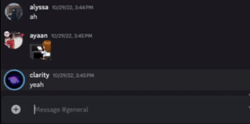

# impersonate 🪞

Simple impersonation Discord bot

Built with [`discord.py`](https://discordpy.readthedocs.io/en/stable/), publishable with [`Docker`](https://www.docker.com/).



- [Requirements](#requirements)
- [Usage](#usage)
  - [Local](#local)
    - [Virtual Environment](#virtual-environment)
    - [Installation](#installation)
    - [Configuration](#configuration)
  - [Running the Bot](#running-the-bot)
  - [Docker](#docker)

---

## Requirements
- Python 3.10+
- Docker (optional, for containerization)
- Docker Compose (optional, for containerization)
- A Discord bot token (create one at [Discord Developer Portal](https://discord.com/developers/applications))
- A Discord server where you (and the bot) have **manage webhook** permissions

---

## Usage

### Local

#### Virtual Environment
Create a virtual environment
```bash
python -m venv venv
```
Activate the virtual environment
```bash
source venv/bin/activate  # On Windows use `venv\Scripts\activate`
```

#### Installation
```bash
pip install -r requirements.txt
```

### Configuration
- Create a `.env` & `.env.local` file in the root directory.
    - Copy the contents of [`example.env`](example.env)
    - Update the `DISCORD_TOKEN` with your bot token.
    - Update the `GUILD_ID` with designated development server ID.
    > `.env.local` is used for running the bot locally, while `.env` is used for production (Docker).
    > - In production the application commands will be registered globally, while in local development they will be registered only in the specified guild.

## Running the Bot
Run the bot
```bash
python3 main.py
```

### Docker

Build
```bash
docker-compose up --build
```

Run
```bash
docker-compose up
```

To stop the bot, use:
```bash
docker-compose down
```
